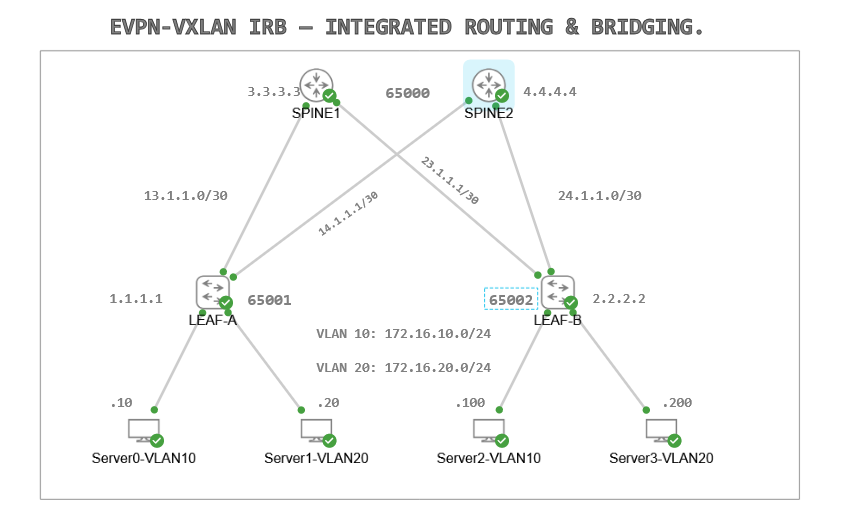

# Cisco CML EVPN-VXLAN L2 Stretch and Inter-VLAN Routing Lab

## Overview

This lab demonstrates an **EVPN-VXLAN leaf-spine data center fabric** built in **Cisco CML**.

The goal of the lab is to validate both **Layer 2 extension** and **Layer 3 inter-VLAN routing** across a VXLAN fabric using an EVPN control plane.

The fabric consists of:

- Two spine switches
- Two leaf switches
- Four end hosts
- Two stretched VLANs: VLAN 10 and VLAN 20

VLAN 10 and VLAN 20 are stretched across both leaf switches. Inter-VLAN communication is provided using SVIs/IRB on the leaf switches.

This lab also documents a troubleshooting issue where inter-VLAN communication failed because the Nexus `arp-ether` TCAM region was allocated `0`. Reallocating the TCAM region resolved the forwarding issue.


---

## Topology



---

## Nodes:

- LEAF-A - NX-OSv 9000
- LEAF-B - NX-OSv 9000
- SPINE1 - IOS XE/IOL
- SPINE2 - IOS XE/IOL
- Server0-VLAN10
- Server1-VLAN20
- Server2-VLAN10
- Server3-VLAN20

---

## Lab Objectives

The main objectives of this lab are to:

- Build a 2-spine / 2-leaf data center topology.
- Configure an underlay network between the spines and leaves.
- Configure EVPN as the VXLAN control plane.
- Configure VXLAN VNIs for VLAN extension.
- Stretch VLAN 10 and VLAN 20 across both leaf switches.
- Configure inter-VLAN routing using SVIs / IRB.
- Validate host-to-host communication within and across VLANs.
- Troubleshoot EVPN-VXLAN forwarding issues.
- Identify the impact of Nexus TCAM resource allocation on VXLAN/EVPN forwarding.

---

## High-Level Design

The spines provide the routed core/control-plane transport between the leaves.

The leaves act as VXLAN Tunnel Endpoints, also known as **VTEPs**. Hosts connect directly to the leaves in VLAN 10 and VLAN 20.

VLAN 10 and VLAN 20 are mapped to VXLAN VNIs and stretched across both leaves. This allows hosts in the same VLAN to communicate even when they are attached to different leaf switches.

SVIs on the leaf switches provide default gateway services for VLAN 10 and VLAN 20. This enables inter-VLAN routing between VLAN 10 and VLAN 20.

This design is commonly referred to as:

- **EVPN-VXLAN IRB**
- **Integrated Routing and Bridging**
- **L2 stretch with L3 inter-VLAN routing**
- **Anycast gateway design**

---

## Underlay

The underlay provides basic IP reachability between the leaf and spine switches.

Typical underlay components include:

- Routed leaf-spine links
- Loopback interfaces
- Dynamic routing between leaf and spine devices
- Equal-cost paths through both spines

The underlay must be working before the EVPN-VXLAN overlay can function correctly.
> VTEP loopback reachability is mandatory. LEAF-A and LEAF-B must be able to reach each other’s VTEP loopback addresses through the BGP underlay before the VXLAN overlay can operate correctly.
Verify with:

```bash
show bgp ipv4 unicast summary
show ip bgp summary
show ip route <remote-vtep-loopback-ipaddress>
ping <remote-vtep-loopback-ipaddress> source <local-vtep-loopback-ipaddress>
```
---

## Overlay

The overlay provides VXLAN encapsulation and EVPN-based control-plane learning.

Typical overlay components include:

- NVE interface on the leaf switches
- VXLAN Network Identifiers, also known as VNIs
- EVPN address family
- Route distinguishers
- Route targets
- VTEP loopbacks
- VLAN-to-VNI mapping

---

## Nexus Features Required

The following features need to be enabled on the Nexus leaf switches:

```bash
nv overlay evpn
feature bgp
feature fabric forwarding
feature interface-vlan
feature vn-segment-vlan-based
feature nv overlay
```

### Feature Purpose

| Feature | Purpose |
|---|---|
| `nv overlay evpn` | Enables EVPN as the VXLAN control plane. |
| `feature bgp` | Enables BGP, which is used to exchange EVPN routes. |
| `feature fabric forwarding` | Enables anycast gateway support. |
| `feature interface-vlan` | Allows the creation of SVIs for Layer 3 routing. |
| `feature vn-segment-vlan-based` | Allows VLANs to be mapped to VXLAN VNIs. |
| `feature nv overlay` | Enables VXLAN/NVE overlay support. |


---

## EVPN / VXLAN Verification

Use the following commands on the leaf switches to verify the EVPN-VXLAN fabric.

```bash
show bgp l2vpn evpn summary
```

Checks whether the BGP EVPN neighbors are up and exchanging prefixes.

```bash
show bgp l2vpn evpn
```

Displays the EVPN database, including learned MAC/IP routes.

```bash
show nve vni
```

Confirms that the VNIs are active and mapped to the correct VLANs.

```bash
show nve peers
```

Verifies that VXLAN tunnel peers are established between VTEPs.

```bash
show l2route evpn mac all
```

Displays local and remote MAC learning through EVPN, including sequence numbers used for host mobility.

```bash
show mac address-table
```

Checks the forwarding table for MAC-to-interface or MAC-to-NVE mappings.

---

## Host Connectivity Tests

### Same-VLAN Communication Across Leaves

From `Server0-VLAN10`, test connectivity to the VLAN 10 host on the remote leaf:

```bash
ping <Server2-VLAN10-IP>
```

From `Server1-VLAN20`, test connectivity to the VLAN 20 host on the remote leaf:

```bash
ping <Server3-VLAN20-IP>
```

### Inter-VLAN Communication

From `Server0-VLAN10`, test connectivity to VLAN 20 hosts:

```bash
ping <Server1-VLAN20-IP>
ping <Server3-VLAN20-IP>
```

### Expected Results

- VLAN 10 hosts can communicate across the VXLAN fabric.
- VLAN 20 hosts can communicate across the VXLAN fabric.
- VLAN 10 and VLAN 20 hosts can communicate through the configured SVIs/IRB gateway.

---

## Issue Encountered

During testing, the EVPN-VXLAN control plane appeared to be correctly configured, but some inter-VLAN traffic failed.

Some host-to-host communication worked, while other same-leaf or inter-VLAN traffic patterns failed unexpectedly.

The underlay and overlay appeared mostly healthy, which suggested that the issue was more likely a forwarding-plane or platform-resource problem rather than a pure BGP EVPN control-plane issue.

---

## Root Cause

The issue was traced to the Nexus `arp-ether` TCAM region.

Initially, the `arp-ether` TCAM region was allocated as `0`.

Because this TCAM region was not allocated, the switch did not have the required forwarding resources for the ARP/ethernet handling needed by the SVI/EVPN-VXLAN design.

After reallocating TCAM space to `arp-ether`, the fabric began forwarding traffic correctly.

> Note: Cisco documentation states that when an SVI is enabled on a VXLAN VTEP, the arp-ether TCAM region must be carved on certain Nexus 9000 platforms. This requirement does not apply to several newer Nexus 9000 families, including Nexus 9200, 9300-EX/FX/GX variants, and supported Nexus 9500 line cards, so behaviour may vary depending on the platform and NX-OS release.

---

## Fix

First, verify the current TCAM allocation:

```bash
show hardware access-list tcam region | include arp-ether
```

If `arp-ether` is allocated as `0`, reallocate TCAM space to it.

Example:

```bash
hardware access-list tcam region arp-ether 256 double-wide
```

Depending on the NX-OSv/Nexus image, you may need to reduce another TCAM region to create space.

Example:

```bash
hardware access-list tcam region racl 512
hardware access-list tcam region arp-ether 256 double-wide
```

Then verify the allocation again:

```bash
show hardware access-list tcam region
```

> Note: On physical Nexus platforms, TCAM carving changes often require a reload before taking effect. In Cisco CML/NX-OSv, behaviour may vary depending on the image version.

---

## Troubleshooting Commands

Useful troubleshootng commnds:

```bash
show ip interface brief
show bgp l2vpn evpn summary
show bgp l2vpn evpn
show nve vni
show nve peers
show l2route evpn mac all
show mac address-table
show ip arp
show vlan brief
show interface vlan <vlan-id>
show hardware access-list tcam region
```

---

## Key Lesson Learned

A healthy EVPN-VXLAN control plane does not always guarantee successful traffic forwarding.

In this lab, BGP EVPN and NVE appeared mostly correct, but traffic still failed because the Nexus platform did not have the required `arp-ether` TCAM resources allocated.

EVPN-VXLAN troubleshooting should therefore include:

- Underlay reachability checks
- BGP EVPN control-plane checks
- NVE peer and VNI checks
- MAC and ARP table checks
- SVI/IRB checks
- Platform forwarding-resource checks

---

## Summary

This lab validates an EVPN-VXLAN leaf-spine fabric providing both **Layer 2 stretch** and **inter-VLAN routing**.

The main troubleshooting finding was that the Nexus `arp-ether` TCAM region was initially allocated `0`, which caused forwarding issues despite the EVPN/VXLAN configuration appearing correct.

After reallocating TCAM resources, host communication worked as expected.

The lab demonstrates not only EVPN-VXLAN configuration knowledge, but also practical troubleshooting across the control plane, data plane, and platform resource layer.

## 📧 Contact

- **Author**: Patrick Ukponu
- Network Engineer|CCNP Enterprise|Cyber Security Specialist|
- **LinkedIn**: https://www.linkedin.com/in/patrick-u-78a001176/
- **Email**: pat.ukponu@gmail.com
